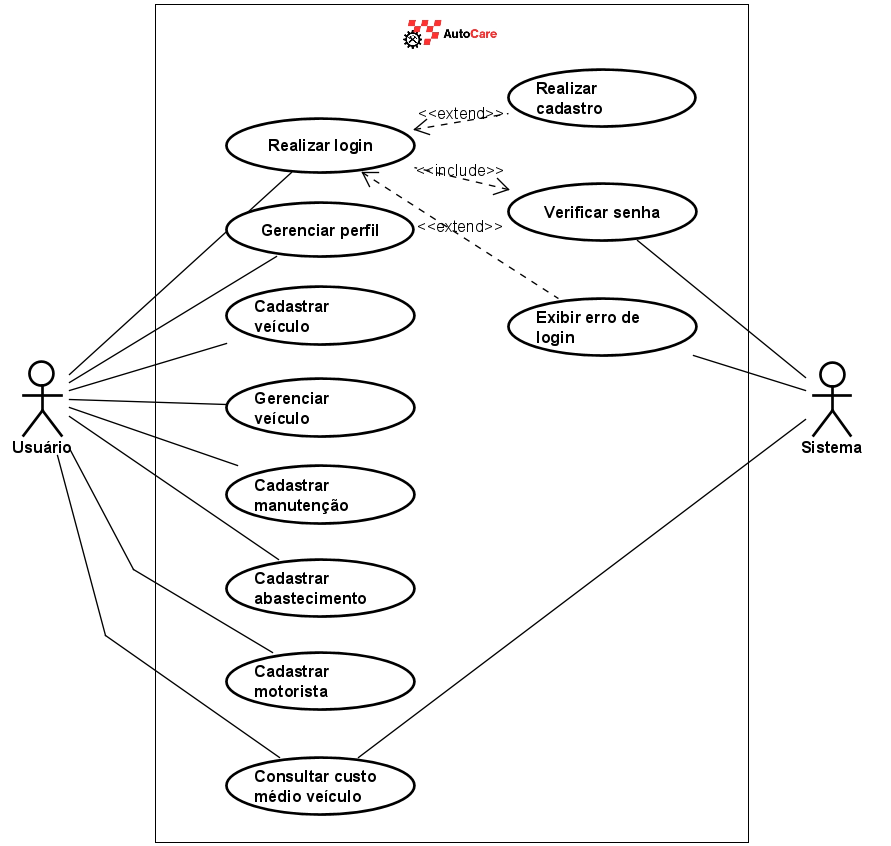

# Especificações do Projeto 

Pré-requisitos: <a href="1-Documentação de Contexto.md"> Documentação de Contexto</a>

Definição do problema e ideia de solução a partir da perspectiva do usuário. É composta pela definição do  diagrama de personas, histórias de usuários, requisitos funcionais e não funcionais além das restrições do projeto.

Apresente uma visão geral do que será abordado nesta parte do documento, enumerando as técnicas e/ou ferramentas utilizadas para realizar a especificações do projeto

## Personas

3 - PERSONAS E HISTÓRIAS DE USUÁRIOS 

 A equipe realizou pesquisas com potenciais usuários da aplicação visando traçar quais problemas o software resolverá. A partir disso, os levantamentos foram compilados na forma de Personas e Histórias de Usuários, conforme apresentado a seguir. 

 Personas 

Ao criar perfis e histórias de usuários para um aplicativo voltado ao público-alvo descrito acima, foi importante detalhar as necessidades, motivações e comportamentos de cada grupo. Esses perfis (ou personas) ajudam no desenvolvimento de funcionalidades específicas, na personalização da experiência do usuário e na criação de conteúdo relevante. Aqui estão exemplos de perfis: 

|João Nogueira       |                                               |                                           |
|--------------------|-----------------------------------------------|----------------------------------------   |
|Idade: 35 anos      |Segmento: Proprietários individuais de veículo | Veículo: Sedan para uso pessoal e familiar|               
|Gerente de vendas   |Prioridades: Praticidade                       | Motivações/objetivos: Família             |
 

|Ana Bugalho         |                                               |                                         |
|--------------------|-----------------------------------------------|-----------------------------------------|
|Idade: 45 anos      |Segmento: Empresas com Frotas de veículos      | Veículo: Frota de 50 caminhões          |               
|gerente de operações|Prioridades: maximizar a eficiência da frota   | Motivações/objetivos: Redução de custos |                                          |empresa logística   |                                               |                                         |

|Carlos Munhoz          |                                                 |                                                      |
|-----------------------|-------------------------------------------------|------------------------------------------------------|
|Idade: 50 anos         |Segmento: Oficinas Mecânicas e Centro Automotivos| Veículo: Veículos de terceiros                       |               
|Proprietário de Oficina|Prioridades: Serviço ao cliente                  | Motivações/objetivos: Modernizar a gestão do negócio |
|mecânica               |                                                 |                                                      |
                                                                             

 
|Maria Julia            |                                     |                                                                  |
|-----------------------|-------------------------------------|------------------------------------------------------------------|
|Idade: 29 anos         |Segmento: Motoristas de Aplicativos  | Veículo: Veiculo próprio para trabalha integral 60 horas semanais|               
|Motorista de aplicativo|Prioridades: Serviço ao cliente      | Motivações/objetivos:Garantir a manutenção e funcionamento       |
 

|Pedro Mauricio         |                                                    |                                                            |
|-----------------------|----------------------------------------------------|------------------------------------------------------------|
|Idade: 50 anos         |Segmento: Entusiastas e colecionadores de automoveis| Veículo: Pequena coleção de carros raros                   |               
|Advogado e colecionador|Prioridades:  Restauração de veículos de coleção    | Motivações/objetivos: Manter a manutenção da coleção em dia|
                                                                             

|Fernanda Braga                 |                                                  |                                                |
|-------------------------------|--------------------------------------------------|------------------------------------------------|
|Idade: 37 anos                 |Segmento: Oficinas Mecânicas e Centro Automotivos | Veículo: Pequena coleção de carros raros       |               
|Gestora de locadora de veículos|Prioridades:  Serviço ao cliente                  | Motivações/objetivos: maximizar a rentabilidade|
                                                                                                                     

|Lucas Emanuel    |                                                  |                                                         |
|-----------------|--------------------------------------------------|---------------------------------------------------------|
|Idade: 23 anos   |Segmento: Público com baixa experiência           |                                                         |
|Estagiário       |em Manutenção Veicular                            | Veículo: Primeiro veículo                               |               
|                 |Prioridades:  Serviço ao cliente                  | Motivações/objetivos: Aprender sobre manutenção básica  |

|Claudia Queiroz   |                                         |                                           |
|------------------|-----------------------------------------|-------------------------------------------|
|Idade: 57 anos    |Segmento: Família com múltiplos veículos | Veículo: 3 veículos familiares            |
|Gestão familiar   |Prioridade: Organizacão e manutenção     | Motivações/objetivos: Segurança familiar  |               

 

 

## Histórias de Usuários

Com base na análise das personas forma identificadas as seguintes histórias de usuários:

|EU COMO... `PERSONA`| QUERO/PRECISO ... `FUNCIONALIDADE`         |PARA ... `MOTIVO/VALOR`                 |
|--------------------|--------------------------------------------|----------------------------------------|
|João Nogueira       |Aplicativo que envie lembretes automáticos  |João deseja manter o carro em bom estado, mas costuma esquecer datas de revisão e troca de óleo. 
|Ana Bugalho         | monitorar a condição de cada veículo da frota, programar manutenções preventivas e gerar relatórios detalhados sobre o uso e os custos de cada veículo.        |integrar com outros sistemas de gestão que ela já utiliza.|
|Carlos Munhoz       |Gerenciar o histórico de serviços dos clientes, lembrando-os sobre revisões futuras e facilitando a comunicação com eles.|Melhorar a organização interna da oficina, com controle de peças e agendamento de serviços| 
|Maria Julia         |Monitorar a quilometragem, agendar manutenções preventivas e calcular os custos operacionais, como combustível e manutenção, para manter seu negócio rentável. |Garantir que seu carro esteja sempre em boas condições, pois depende dele para sua renda |
|Pedro Maurício      |registrar todos os detalhes de suas restaurações, incluindo fotos e notas sobre o processo | Deseja manter um histórico de manutenção rigoroso para preservar o valor dos veículos.|
|Lucas Emanuel       |aplicativo simples e intuitivo que o guie nas tarefas básicas de manutenção, como verificar o óleo, calibrar os pneus e agendar revisões. |dicas e tutoriais para ajudá-lo a cuidar do carro|

Apresente aqui as histórias de usuário que são relevantes para o projeto de sua solução. As Histórias de Usuário consistem em uma ferramenta poderosa para a compreensão e elicitação dos requisitos funcionais e não funcionais da sua aplicação. Se possível, agrupe as histórias de usuário por contexto, para facilitar consultas recorrentes à essa parte do documento.

> **Links Úteis**:
> - [Histórias de usuários com exemplos e template](https://www.atlassian.com/br/agile/project-management/user-stories)
> - [Como escrever boas histórias de usuário (User Stories)](https://medium.com/vertice/como-escrever-boas-users-stories-hist%C3%B3rias-de-usu%C3%A1rios-b29c75043fac)
> - [User Stories: requisitos que humanos entendem](https://www.luiztools.com.br/post/user-stories-descricao-de-requisitos-que-humanos-entendem/)
> - [Histórias de Usuários: mais exemplos](https://www.reqview.com/doc/user-stories-example.html)
> - [9 Common User Story Mistakes](https://airfocus.com/blog/user-story-mistakes/)

## Requisitos

As tabelas a seguir, apresentam os requisitos funcionais e não funcionais da aplicação, além da definição de seu nível de prioridade classificados em: alta, média ou baixa prioridade:

### Requisitos Funcionais

| Código (ID)  | Descrição                                                                                                       | Prioridade |
|---------|----------------------------------------------------------------------------------------------------------------|------------|
| **RF-01** | A aplicação deve permitir que o usuário faça um cadastro com login e senha.                                    | Alta       |
| **RF-02** | A aplicação deve permitir login e logout para uma experiência personalizada e individualizada pelo usuário.    | Alta       |
| **RF-03** | A aplicação deve permitir o gerenciamento de perfis (permitir que os usuários atualizem suas informações de endereço, número de telefone, foto, etc.). | Baixa      |
| **RF-04** | A aplicação deve permitir que o usuário opte pelo “Dark Mode” ou “Light Mode”.                                 | Baixa      |
| **RF-05** | O sistema deve permitir que os usuários registrem e acompanhem todas as manutenções realizadas nos veículos, incluindo data, tipo de serviço, quilometragem, e custos envolvidos. | Alta       |
| **RF-06** | O sistema deve permitir que os usuários adicionem e gerenciem múltiplos veículos em uma única conta.            | Média      |
| **RF-07** | A aplicação deve conter um cadastro de motoristas, com informações pessoais e históricos de conduções anteriores. | Baixa      |
| **RF-08** | O sistema deve permitir o registro de abastecimentos com informações de data, quantidade de Lts e tipo de combustível. | Média      |
| **RF-09** | O sistema deve calcular o custo médio do veículo, usando informações como consumo, manutenção e afins.         | Baixa      |

### Requisitos não Funcionais

| Código (ID) | Descrição                                                                                                                                                           | Prioridade |
|-------------|---------------------------------------------------------------------------------------------------------------------------------------------------------------------|------------|
| **RNF-01**  | O sistema deve oferecer uma interface intuitiva e fácil de usar, com navegação clara e acessível, permitindo que usuários de diferentes níveis de conhecimento tecnológico possam utilizar o aplicativo sem dificuldades. | Alta       |
| **RNF-02**  | A aplicação deve ser responsiva e adequada a qualquer sistema de acesso (Desktop, Smartphone ou Tablet).                                                             | Alta       |
| **RNF-03**  | O sistema deve garantir fácil manutenibilidade.                                                                                                                     | Média      |
| **RNF-04**  | O sistema deve garantir que todas as informações dos usuários, incluindo dados de veículos, sejam protegidas.                                                        | Alta       |
| **RNF-05**  | O sistema deve ser capaz de processar e armazenar os dados, garantindo que o tempo de resposta seja rápido mesmo com grandes volumes de dados.                        | Alta       |
| **RNF-06**  | O sistema deve ser altamente disponível, com um tempo de inatividade mínimo, garantindo que os usuários possam acessar e utilizar o aplicativo a qualquer momento, com backups regulares para evitar perda de dados. | Alta       |

## Restrições

Os fatores apresentados na tabela a seguir tratam dos processos que restringem o desenvolvimento da plataforma:

| Código (ID)       | Descrição                                                                                                                     |
|----------|--------------------------------------------------------------------------------------------------------------------------------|
| **RE-01** | A Etapa 1 da aplicação tem como prazo de entrega a data: 01/09/2024.                                                          |
| **RE-02** | A equipe não pode contratar, nem delegar funções a terceiros.                                                                 |
| **RE-03** | Algumas funcionalidades do aplicativo, como o armazenamento em nuvem de documentos e a sincronização de dados, exigirão uma conexão ativa com a internet. |
| **RE-04** | O desenvolvimento do aplicativo deve estar em conformidade com as regulamentações de privacidade e proteção de dados - LGPD (Lei Geral de Proteção de Dados) no Brasil. |

## Matriz de Rastreabilidade

|            | RF-01 | RF-02 | RF-03 | RF-04 | RF-05 | RF-06 | RF-07 | RF-08 | RF-09 | RNF-01 | RNF-02 | RNF-03 | RNF-04 | RNF-05 | RNF-06 |
|------------|-------|-------|-------|-------|-------|-------|-------|-------|-------|--------|--------|--------|--------|--------|--------|
| **RF-01**  |       | ✔️    |       |       |       |       |       |       |       | ✔️     | ✔️     |        | ✔️     |        |        |
| **RF-02**  |       |       | ✔️    |       | ✔️    | ✔️    | ✔️    | ✔️    | ✔️    | ✔️     | ✔️     |        |        |        | ✔️     |
| **RF-03**  |       |       |       |       |       |       |       |       |       | ✔️     | ✔️     |        | ✔️     | ✔️     |        |
| **RF-04**  |       |       |       |       |       |       |       |       |       | ✔️     |        |        |        |        |        |
| **RF-05**  |       |       |       |       |       |       |       |       | ✔️    | ✔️     |        |        | ✔️     | ✔️     | ✔️     |
| **RF-06**  |       |       |       |       |       |       | ✔️    |       | ✔️    | ✔️     | ✔️     |        | ✔️     | ✔️     |        |
| **RF-07**  |       |       |       |       |       |       |       |       |       | ✔️     | ✔️     |        |        | ✔️     | ✔️     |
| **RF-08**  |       |       |       |       |       |       |       |       |       | ✔️     | ✔️     |        | ✔️     | ✔️     |        |
| **RF-09**  |       |       |       |       |       |       |       |       |       | ✔️     |        |        |        | ✔️     | ✔️     |
| **RNF-01** |       |       |       |       |       |       |       |       |       |        |        |        |        |        |        |
| **RNF-02** |       |       |       |       |       |       |       |       |       | ✔️     |        |        |        |        |        |
| **RNF-03** |       |       |       |       |       |       |       |       |       |        |        |        |        |        | ✔️     |
| **RNF-04** |       |       |       |       |       |       |       |       |       |        |        |        |        |        |        |
| **RNF-05** |       |       |       |       |       |       |       |       |       |        |        |        |        |        |        |
| **RNF-06** |       |       |       |       |       |       |       |       |       |        |        | ✔️     |        |        |        |
| **EDUARDO**| ✔️    | ✔️    | ✔️    | ✔️    | ✔️    |       |       |       |       | ✔️     | ✔️     | ✔️     | ✔️     | ✔️     | ✔️     |
| **LAÍS**   |       |       |       |       |       |       |       |       |       |        |        |        |        |        |        |
| **LUCAS**  |       |       |       |       |       |       |       |       |       |        |        |        |        |        |        |
| **MARCO A.**|       |       |       |       |       |       |       |       |       |        |        |        |        |        |        |
| **MATHEUS**|       |       |       |       |       | ✔️    | ✔️    | ✔️    | ✔️    |        |        |        |        |        |        |

## Indicadores de Desempenho

| **INDICADOR**                | **OBJETIVOS**                                         | **DESCRIÇÃO**                                           | **CÁLCULO**                             | **FONTE DADOS**                              | **PERSPECTIVA**                              |
|------------------------------|-------------------------------------------------------|---------------------------------------------------------|-----------------------------------------|----------------------------------------------|----------------------------------------------|
| Número de downloads realizados | Medir o nível de interesse gerado pelo aplicativo    | Quantidade de downloads realizados na loja eletrônica  | Somatório total de downloads            | Loja eletrônica                              | Nível de satisfação                          |
| Número de usuários ativos    | Avaliar a adesão e uso contínuo do aplicativo         | Número de usuários que utilizam o aplicativo regularmente | Contagem de usuários ativos             | Banco de dados da aplicação                  | Engajamento                                  |
| Nota média do aplicativo     | Analisar a satisfação geral dos usuários              | Média das notas atribuídas pelos usuários nas lojas eletrônicas | Média das notas                           | Loja eletrônica                              | Aprimoramento                                |
| Taxa de retenção de usuários | Verificar a fidelidade dos usuários                    | Percentual de usuários que continuam a usar o aplicativo após um período definido | Percentual de usuários retidos            | Banco de dados da aplicação                  | Retenção                                     |
| Reclamações                  | Verificar quais os principais pontos negativos do aplicativo | Entender e atuar sobre as reclamações apresentadas pelos usuários | Quantidade e qualidade das reclamações | Loja eletrônica e canais de comunicação do AutoCare | Aprimorar os pontos negativos da aplicação   |
| Elogios                      | Verificar quais os principais pontos positivos do aplicativo | Entender e potencializar as qualidades da aplicação apresentadas pelos usuários | Quantidade e qualidade dos elogios      | Loja eletrônica e canais de comunicação do AutoCare | Potencializar as funcionalidades valorizadas pelos usuários |
| Periodicidade de acessos     | Analisar o tempo de inatividade dos usuários           | Entender os padrões de acesso da aplicação             | Média de tempo entre acessos do usuário | Banco de dados da aplicação                  | Aprimoramento e melhoria de engajamento da aplicação |
| Taxa de erro de funcionalidades | Medir a confiabilidade das funcionalidades do aplicativo | Percentual de erros reportados em funcionalidades do aplicativo | Percentual de erros                      | Banco de dados da aplicação                  | Qualidade e confiabilidade                    |

## Modelamgem do processo de negócios

### Análise da situação atual
Para conseguir gerenciar uma frota de veículos é preciso ter clareza de todos os gastos existentes dos veículos, isso afeta diretamente um negócio fazendo-o dar certo ou não  , reduzir o consumo de combustível, riscos de problemas mecânicos, otimizar rotas são meios de aumentar as margens de lucro de uma locadora.

### Descrição geral da proposta

A aplicação visa ajudar as empresas a otimizar os gastos e ter um controle maior sobre a sua frota

### Processo 1 – Visualizar histórico do veículo

## Diagrama de Casos de Uso

O diagrama de casos de uso é o próximo passo após a elicitação de requisitos, que utiliza um modelo gráfico e uma tabela com as descrições sucintas dos casos de uso e dos atores. Ele contempla a fronteira do sistema e o detalhamento dos requisitos funcionais com a indicação dos atores, casos de uso e seus relacionamentos. 

|Relacionamento      |Ator                                           |Ação                                                                                              |
|--------------------|-----------------------------------------------|--------------------------------------------------------------------------------------------------|
|Associação          |Usuário                                        | Realizar o login ou cadastro.                                                                    |               
|Associação          |Usuário                                        | Cadastrar seu(s) veículo(s).                                                                     |
|Associação          |Usuário                                        | Gerenciar seu(s) veículo(s).                                                                     |
|Associação          |Usuário                                        | Cadastrar seu(s) abastecimento(s).                                                               |
|Associação          |Usuário                                        | Cadastrar motorista(s).                                                                          |
|Associação          |Usuário                                        | Consultar custo médio veículo.                                                                   |
|Associação          |Sistema                                        | Verificar senha.                                                                                 |
|Associação          |Sistema                                        | Exibir erro de login.                                                                            |
|Associação          |Sistema                                        | Consultar custo médio veículo.                                                                   |
|Inclusão            | -                                             | Toda vez que o usuário realizar Login, o sistema verificará a senha automaticamente.             |
|Extensão            | -                                             | Apenas quando o usuário digitar senha errada, aparecerá a mensagem de erro de login.             |
|Extensão            | -                                             | Apenas quando o usuário não possuir cadastro, poderá se cadastrar.             |

# Gerenciamento de Projeto 

De acordo com o PMBoK v6 as dez áreas que constituem os pilares para gerenciar projetos, e que caracterizam a multidisciplinaridade envolvida, são: Integração, Escopo, Cronograma (Tempo), Custos, Qualidade, Recursos, Comunicações, Riscos, Aquisições, Partes Interessadas. Para desenvolver projetos um profissional deve se preocupar em gerenciar todas essas dez áreas. Elas se complementam e se relacionam, de tal forma que não se deve apenas examinar uma área de forma estanque. É preciso considerar, por exemplo, que as áreas de Escopo, Cronograma e Custos estão muito relacionadas. Assim, se eu amplio o escopo de um projeto eu posso afetar seu cronograma e seus custos.

## Gerenciamento de Tempo

O gráfico de Gantt ou diagrama de Gantt também é uma ferramenta visual utilizada para controlar e gerenciar o cronograma de atividades de um projeto. Com ele, é possível listar tudo que precisa ser feito para colocar o projeto em prática, dividir em atividades e estimar o tempo necessário para executá-las.

## Gerenciamento de Equipe

O gerenciamento adequado de tarefas contribuirá para que o projeto alcance altos níveis de produtividade. Por isso, é fundamental que ocorra a gestão de tarefas e de pessoas, de modo que os times envolvidos no projeto possam ser facilmente gerenciados. O gerenciamento de nossa equipe está distribuído por afinidade em cada tecnologia e preferências de desenvolvimento

## Gerenciamento de Orçamento

| Despesas            | Agosto     | Setembro   | Outubro    | Novembro   | Dezembro   | Total       |
|---------------------|------------|------------|------------|------------|------------|-------------|
| Gerente de projeto  | R$ 8.500,00| R$ 8.500,00| R$ 8.500,00| R$ 8.500,00| R$ 8.500,00| R$ 42.500,00|
| Dev back-end        | R$ 4.500,00| R$ 4.500,00| R$ 4.500,00| R$ 4.500,00| R$ 4.500,00| R$ 22.500,00|
| Dev front-end       | R$ 4.000,00| R$ 4.000,00| R$ 4.000,00| R$ 4.000,00| R$ 4.000,00| R$ 20.000,00|
| Designer            | R$ 3.700,00| R$ 3.700,00| R$ 3.700,00| R$ 3.700,00| R$ 3.700,00| R$ 18.500,00|
| Equipamentos        | R$ 28.500,00| R$ 0,00    | R$ 0,00    | R$ 0,00    | R$ 0,00    | R$ 28.500,00|
| Manutenção          | R$ 0,00    | R$ 750,00  | R$ 420,00  | R$ 0,00    | R$ 310,00  | R$ 1.480,00 |
| Energia             | R$ 910,00  | R$ 1.020,00| R$ 940,00  | R$ 1.180,00| R$ 880,00  | R$ 4.930,00 |
| Aluguel             | R$ 3.400,00| R$ 3.400,00| R$ 3.400,00| R$ 3.400,00| R$ 3.400,00| R$ 17.000,00|
| **Despesas Totais** | **R$ 53.510,00** | **R$ 25.870,00** | **R$ 25.460,00** | **R$ 25.280,00** | **R$ 25.290,00** | **R$ 155.410,00** |

