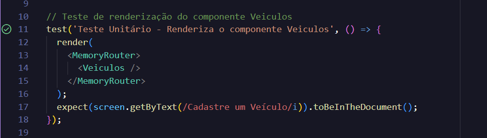

f# Testes de Rota do Backend

## Teste da Rota "CREATE - Usuários"

A GIF a seguir demonstra a funcionalidade da rota **CREATE** no arquivo `Usuarios.js`, que permite o cadastro de novos usuários no sistema. Através da requisição, um novo usuário é criado com os dados fornecidos, validando a operação e garantindo a inserção correta no banco de dados.

<p align="center">
    <br>
  
    <br>
</p>

---

## Teste da Rota "GET - Usuários"

A GIF a seguir demonstra a funcionalidade da rota **GET ALL** no arquivo `Usuarios.js`, que permite a recuperação de todos os usuários cadastrados no sistema. Através da requisição, os dados de todos os usuários são retornados, permitindo visualizar a lista completa de registros armazenados no banco de dados.


---

## Teste da Rota "LOGIN - Usuários"

A GIF a seguir ilustra o funcionamento da rota **LOGIN** no arquivo `Usuarios.js`, que possibilita a autenticação de usuários. Durante o processo, o usuário insere suas credenciais (email e senha). Ao ser validado corretamente, ele recebe um token de autenticação. Além disso, a GIF também mostra o caso de tentativa de login com senha incorreta, onde o sistema responde adequadamente, destacando a verificação das credenciais.
  
<p align="center">
    <br>
  
    <br>
</p>
<br>

## Testes Unitários do Login 

### Web 

##### Testes Unitários 
O teste unitário do componente de login do AutoCare verifica se o componente é renderizado corretamente.

- **Renderização do formulário de Login**: O teste garante que o componente de login está sendo exibido corretamente na tela, confirmando que todos os elementos visuais, como campos de entrada e botões, estão presentes e funcionais.

***As duas imagens a seguir, demonstram o teste de render do componente Login com sucesso.***

<p align="center">
    
    <br>

##### Registro de Código de Teste + Registro de Teste com sucesso
<p align="center">

<br>

### Mobile 

#### Testes Unitários da Tela de Login

##### Testes Unitários
- **Renderização do formulário de login**: Verifica se os elementos da interface, como placeholders e botões, estão sendo exibidos corretamente.
- **Validação dos campos obrigatórios**: Simula a interação do usuário ao pressionar o botão de login sem preencher os campos, verificando se o alerta é acionado quando os campos estão vazios.

##### Código de teste

<p align="center">

</p>

<br>

##### Terminal de teste (Sucesso ✔️)
<p align="center">

</p>

<br><br>

---

## Teste da Rota "EDIT - Usuários"

A GIF a seguir apresenta a funcionalidade da rota **EDIT** no arquivo `Usuarios.js`, que permite a atualização dos dados de um usuário específico. Através da requisição, os campos selecionados do usuário são alterados e a resposta do sistema confirma a modificação com sucesso.

<p align="center">
    <br>
  
    <br>
</p>

---

## Teste da Rota "DELETE - Usuários"

A GIF a seguir mostra o funcionamento da rota **DELETE** no arquivo `Usuarios.js`, que permite a remoção de um usuário do sistema. Através da requisição, o usuário especificado é excluído, e a resposta confirma a operação, assegurando que o registro foi efetivamente removido do banco de dados.

<p align="center">
    <br>
  
    <br>
</p>

---

## Teste da Rota "Create - Veículos"

A GIF a seguir ilustra o teste da rota **CREATE** no arquivo `Veiculos.js`. Esta rota permite a criação de novos veículos, sendo necessário autenticação para concluir o processo. A GIF demonstra a inserção dos dados do veículo e a resposta do sistema após a autenticação bem-sucedida.

<p align="center">
    <br>
  
    <br>
</p>

---

## Teste da Rota "Get - Veículos"

A GIF a seguir ilustra o teste da rota **GET** no arquivo `Veiculos.js`. Esta rota permite a recuperação dos veículos cadastrados. A GIF demonstra a solicitação de dados e a resposta do sistema, mostrando os veículos disponíveis.

<p align="center">
    <br>
  
    <br>
</p>

---

## Teste da Rota "Edit - Veículos"

A GIF a seguir ilustra o teste da rota **EDIT** no arquivo `Veiculos.js`. Esta rota permite a edição de veículos cadastrados, sendo necessário autenticação para concluir o processo. A GIF demonstra a atualização dos dados do veículo e a resposta do sistema após a autenticação bem-sucedida.

<p align="center">
    <br>
  
    <br>
</p>

---

# Testes Unitários no FrontEnd

## Teste de Renderização de Veículos

O seguinte teste unitário confere se o componente de Veículos foi renderizado normalmente na pagina. Teste feito utilizando react-testing-library com vitest.



## Configuração do Ambiente

Para começar a escrever testes unitários em um projeto backend utilizando C#, siga os passos abaixo:

1. **Instale o .NET SDK**: Certifique-se de ter o [.NET SDK](https://dotnet.microsoft.com/download) instalado.

2. **Crie um projeto de testes**: No terminal, navegue até o diretório do seu projeto e execute o seguinte comando para criar um projeto de testes usando xUnit (um framework popular de testes unitários para .NET):

    ```bash
    dotnet new xunit -o tests
    ```

3. **Adicione uma referência ao seu projeto principal**: No diretório do projeto de testes, adicione uma referência ao seu projeto principal:

    ```bash
    dotnet add reference ../src/MyProject.csproj
    ```

4. **Organize sua estrutura de diretórios**: Uma estrutura comum de projeto é a seguinte:

    ```
    MyProject/
    ├── src/
    │   └── MyProject.cs
    └── tests/
        └── MyProject.Tests.cs
    ```

## Exemplo de Teste Unitário

Aqui está um exemplo simples de um teste unitário em C# usando xUnit. Vamos supor que temos um método na classe `Calculator` que soma dois números.

```csharp
// src/MyProject.cs

namespace MyProject
{
    public class Calculator
    {
        public int Add(int a, int b)
        {
            return a + b;
        }
    }
}
