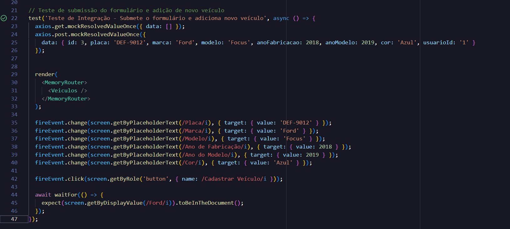

# Testes de Integração no Backend

## O que são Testes de Integração?

Testes de integração são testes automatizados que verificam se diferentes módulos ou componentes de um sistema funcionam corretamente quando integrados. Ao contrário dos testes unitários, que testam pequenas unidades isoladas de código, os testes de integração focam na interação entre várias partes do sistema, como classes, bancos de dados, APIs externas, entre outros.

## Por que são Importantes?

Testes de integração ajudam a:

- Garantir que os diferentes componentes do sistema funcionem bem juntos.
- Detectar problemas que possam surgir da interação entre módulos, como erros de comunicação ou incompatibilidades.
- Validar cenários de uso realistas, onde múltiplas partes do sistema precisam interagir.

# Testes de Integração AutoCare:

## Tela Login

### Teste de Integração do Componente de Login Web 


No projeto AutoCare, implementamos um teste de integração para o componente de login utilizando o **Vitest** e a Testing Library. O objetivo deste teste é garantir que o fluxo de login funcione corretamente, desde a renderização do componente até a submissão do formulário.

O teste é dividido em duas partes principais:

- Renderização do Componente: 


O teste verifica se o componente de login é renderizado corretamente quando utilizado dentro de um MemoryRouter. Essa etapa assegura que todos os elementos visuais esperados, como campos de entrada e o botão de login, estão presentes na tela.

- Login com Sucesso: 

Nesta etapa, simulamos a interação do usuário com o formulário de login. Utilizamos o método fireEvent para preencher os campos de e-mail e senha, e em seguida, disparamos um evento de clique no botão de login. O teste também mocka a chamada de API utilizando o axios, simulando uma resposta bem-sucedida com um token. Após a submissão do formulário, o teste verifica se a mensagem de sucesso "Login realizado com sucesso!" é exibida na tela, confirmando que o fluxo de login foi completado com êxito.

<br>


### Testes de Integração do Login Mobile 

Este arquivo contém testes unitários e de integração para o componente de Login da aplicação AutoCare, desenvolvidos utilizando **Jest**. Os testes verificam a renderização correta dos elementos de UI, a validação dos campos obrigatórios e o comportamento de autenticação com o backend.

#### Estrutura de Testes

O arquivo de testes `Login.test.js` está dividido em duas partes principais:

##### Testes Unitários
- **Renderização do formulário de login**: Verifica se os elementos da interface, como placeholders e botões, estão sendo exibidos corretamente.
- **Validação dos campos obrigatórios**: Gera um alerta caso os campos de usuário e senha não estejam preenchidos ao tentar o login.

##### Testes de Integração
- **Login bem-sucedido**: Simula uma requisição ao backend e, caso as credenciais estejam corretas, navega para a tela principal.
- **Login com falha**: Simula uma tentativa de login com credenciais inválidas e exibe um alerta de erro.

#### Capturas de Tela

<div align="center">


(Sucesso ✔️)

<br><br>

## Tela de Veiculos
### Informações são exibidas após a chamada
Confere se as informações solicitadas são exibidas na tela após o usuário fazer a chamada para a API.  Teste feito com react-testing-library com vitest

## Configuração do Ambiente

Para começar a escrever testes de integração em um projeto backend utilizando C#, siga os passos abaixo:

1. **Instale o .NET SDK**: Certifique-se de ter o [.NET SDK](https://dotnet.microsoft.com/download) instalado.

2. **Crie um projeto de testes**: No terminal, navegue até o diretório do seu projeto e execute o seguinte comando para criar um projeto de testes usando xUnit:

    ```bash
    dotnet new xunit -o tests
    ```

3. **Adicione uma referência ao seu projeto principal**: No diretório do projeto de testes, adicione uma referência ao seu projeto principal:

    ```bash
    dotnet add reference ../src/MyProject.csproj
    ```

4. **Configure um banco de dados para testes**: Se seu projeto interage com um banco de dados, considere usar um banco de dados em memória (como o SQLite in-memory) ou configurar um ambiente de banco de dados separado para os testes.

5. **Organize sua estrutura de diretórios**: Uma estrutura comum de projeto é a seguinte:

    ```
    MyProject/
    ├── src/
    │   └── MyProject.cs
    └── tests/
        └── MyProject.IntegrationTests.cs
    ```

## Exemplo de Teste de Integração

Vamos supor que temos um método na classe `UserService` que adiciona um usuário a um banco de dados. Queremos testar se esse método funciona corretamente ao interagir com o banco de dados.

### Código de Exemplo

Aqui está a implementação da classe `UserService`:

```csharp
// src/MyProject.cs

using System.Data.SqlClient;

namespace MyProject
{
    public class UserService
    {
        private readonly string _connectionString;

        public UserService(string connectionString)
        {
            _connectionString = connectionString;
        }

        public void AddUser(string name, string email)
        {
            using (var connection = new SqlConnection(_connectionString))
            {
                connection.Open();
                var command = new SqlCommand("INSERT INTO Users (Name, Email) VALUES (@Name, @Email)", connection);
                command.Parameters.AddWithValue("@Name", name);
                command.Parameters.AddWithValue("@Email", email);
                command.ExecuteNonQuery();
            }
        }

        public int GetUserCount()
        {
            using (var connection = new SqlConnection(_connectionString))
            {
                connection.Open();
                var command = new SqlCommand("SELECT COUNT(*) FROM Users", connection);
                return (int)command.ExecuteScalar();
            }
        }
    }
}
